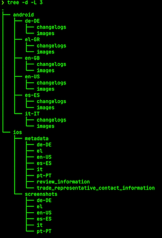

# Developer Docs

Tools used:

- Bitrise CLI
- Fastlane
- Terminal tools such as `jq`

There are 3 ENV vars that need to be defined/setup in CI for this workflow to work:

1. **ANDROID_PACKAGE_NAME**: `com.example.app`

    > Package name of your Android application

2. **ANDROID_SERVICE_ACC_KEY**: `'{your_json_key}'`

    > Service Account Key
    >
    > **Note**:
    >
    > In order to provide Android's Service Account Key, which is a json file when downloaded, you will need to convert it into a processed string. You should use `createEnvVars.sh` script to create the processed version for your local/CI builds.

3. **ANDROID_METADATA_GIT_REPO_SSH_URL**: `git@github.com:username/metadata-apps.git`

    > SSH url for cloning the metadata repository. Usually this repo will be private to your organization. The only thing important is that this repo should be clonable by either Bitrise CI or you (locally).


### Create processed Secret ENV vars via script
In order to simplify the process, you can use the `createEnvVars.sh` script by passing in the `api-android-service-acc-key.json` like below:

```bash
./createEnvVars.sh api-android-service-acc-key.json
```

This script will ask for relevant required info and create either your local `.bitrise.secrets.yml` file with all ENV vars populated so you can use with Bitrise CLI or output to console processed Secret ENV vars which can be copy pasted to Bitrise CI @Bitrise.io under the set workflow.

## Work on Bitrise CI

1. Setup the **Secret** ENV vars for the repo.

1. Replace the online `bitrise.yml` file's content with below:
    ```
    ---
    format_version: 1.4.0
    default_step_lib_source: https://github.com/bitrise-io/bitrise-steplib.git
    workflows:
      update-metadata:
        steps:
        - activate-ssh-key:
            run_if: '{{getenv "SSH_RSA_PRIVATE_KEY" | ne ""}}'
        - git-clone: {}
        - script:
            title: Continue from repo
            inputs:
            - content: "./scripts/update_metadata.sh"
      update-screenshots:
        steps:
        - activate-ssh-key:
            run_if: '{{getenv "SSH_RSA_PRIVATE_KEY" | ne ""}}'
        - git-clone: {}
        - script:
            title: Continue from repo
            inputs:
            - content: "./scripts/update_screenshots.sh"
    ```

## Work on Local

In order to set this up locally you will need to

1. Create a `.bitrise.secrets.yml` file. This is already gitignored.

    ```bash
    touch .bitrise.secrets.yml
    ```

2. Populate `.bitrise.secrets.yml` file as below:

    ```bash
    envs:
    - ANDROID_PACKAGE_NAME: com.example.app
    - ANDROID_SERVICE_ACC_KEY: '{your_json_key}'
    - ANDROID_METADATA_GIT_REPO_SSH_URL: git@github.com:username/metadata-apps.git
    ```

3. To execute a workflow, run `bitrise run workflow_name`. Possible workflows:

    - `bitrise run fetch-metadata`: Fetch existing metadata in Playstore
    - `bitrise run update-metadata`: Update metadata in Playstore
    - `bitrise run update-screenshots`: Update screenshots in Playstore

## Metadata

Metadata is stored under the path `fastlane/metadata/`

- The `fetch-metadata` workflow downloads the metadata inside the `fastlane/metadata/` directory, with data segregated into localized folders such as **en-GB**, **de-DE**, etc.
- The `update-metadata` workflow uploads the metadata inside the `fastlane/metadata/` directory, with data picked from localized folders such as **en-GB**, **de-DE**, etc.
- The `update-screenshots` workflow uploads the screenshots inside the `fastlane/metadata/` directory, with data picked from localized folders such as **en-GB**, **de-DE**, etc.

It is upto you to decide how to populate `metatdata` directory. 

For this workflow, we utilize git repo to sync with a `metadata-apps` private repo to populate the `fastlane/metadata` directory just before uploading metadata. For this reason you need to setup and provide the `ANDROID_METADATA_GIT_REPO_SSH_URL` in the ENV vars.

Any update should be made to the `metadata-apps` and this workflow will sync with the latest changes.

To setup `metadata-apps` repo, simply follow along:
1. Create a new repo named `metadata-apps`. It can be private.
1. Use the `fetch-metadata` workflow to get the initial directory structure.
1. Cut and paste it in your `metadata-apps` repo under `android` directory.
1. Add to git, commit and push to remote `metadata-apps` repository.
1. When you want to make an update to the metadata, directly update the files inside the `metadata-apps` repository under `android` directory and sync it with remote.
1. When the next time `update-metadata` workflow executes, it will sync and pull the latest changes from the `metadata-apps` repository.

Below is a screenshot of how the `metadata-apps` repository directory structure would look like:

